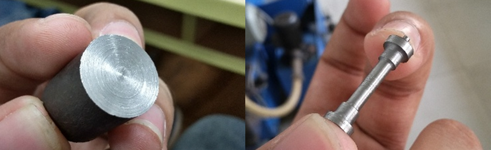
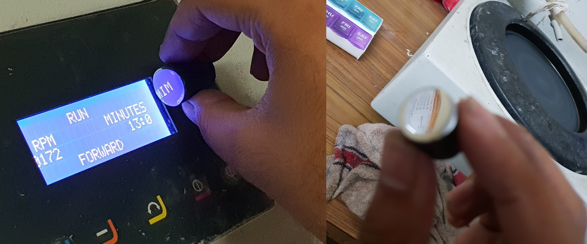
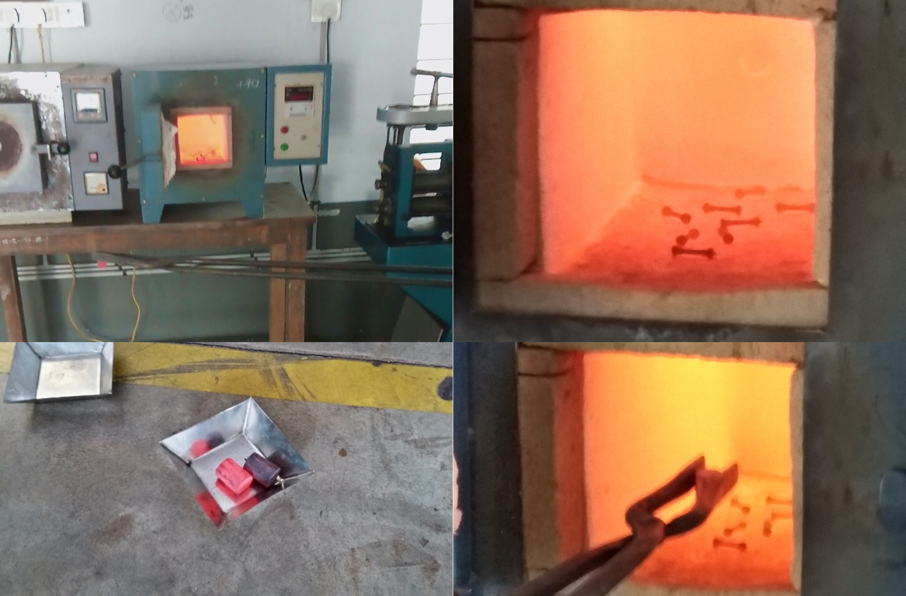

# 🔥 Heat Treatment Research – Undergraduate Study

This repository presents the findings and methodology of my undergraduate research on heat treatment processes applied to **Low Carbon Medium Alloy Steels**. The study focuses on three primary heat treatment techniques — **Normalisation**, **Annealing**, **Hardening** and **Spheroidisation** — as well as various combinations thereof. The final results have been published in a peer-reviewed research paper.

## 📘 Overview

Heat treatment plays a critical role in tailoring the mechanical properties of metals and alloys. This research investigates how different heat treatment methods influence microstructure, hardness, ductility, and overall performance of steel samples.

### Techniques Studied

- **Normalisation**: Heating above the critical temperature followed by air cooling to refine grain structure.
- **Annealing**: Controlled heating and slow cooling to relieve internal stresses and improve ductility.
- **Hardening**: Heating above critical temperature followed by water quenching to get martensitic structure.
- **Spheroidisation**: Prolonged heating near the critical temperature to produce spherical carbides for enhanced machinability.
- **Combinations**: Sequential and hybrid treatments to explore synergistic effects.

## 🧪 Methodology

- **Material Used**: Medium Carbon Low Alloy Steel (EN08 and EN24)
- **Experimental Setup**: Muffle furnace, metallographic preparation, hardness testing
- **Characterization Techniques**:
  - Optical microscopy
  - Rockwell hardness testing
  - Microstructural analysis

<figure>
    
    <figcaption>
    Figure 1: Specimen machining on lathe (left) and CNC (right)
    </figcaption>
</figure>

<figure>
    
    <figcaption>
    Figure 2: Mirror polishing for morphology study
    </figcaption>
</figure>

<figure>
    
    <figcaption>
    Figure 3: Heat treatment
    </ficaption>
</figure>

## 📊 Results Summary

- Normalisation improved grain uniformity and moderate hardness.
- Annealing enhanced ductility but reduced hardness.
- Spheroidisation yielded excellent machinability with minimal hardness.
- Combined treatments revealed nuanced trade-offs between strength and ductility.

## 📄 Publication

The full research findings are published in the following paper:

> **Title**: *Harisha, S.R., Sharma, S., Kini, U.A., Sharma, A. and Joshi, N., 2019. Mechanical properties-morphology corroboration of spheroidized AISI1040 steel. Materials Research Express, 6(8), p.0865g8.*  
> **Co-Author**: Neel Joshi  
> **Journal/Conference**: Materials Research Express, Institute of Physics  